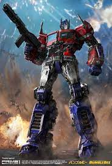
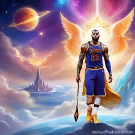
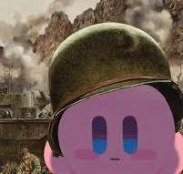
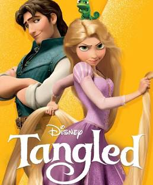
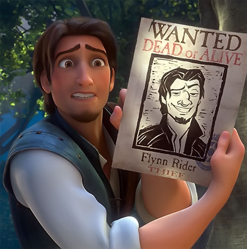
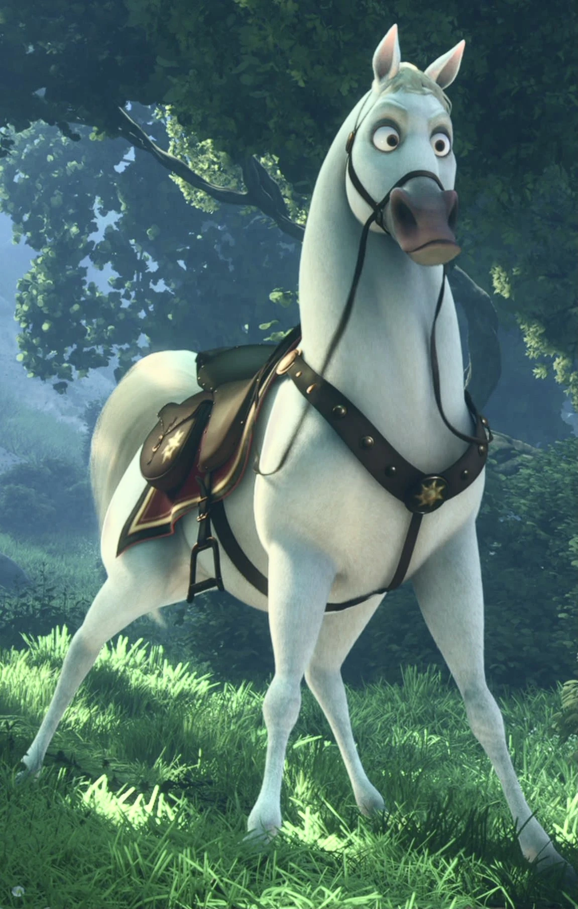

# app-dev
## FOUR SHO - REPOSITORY

### Software Design - 06 Task Performance # 1 

### agentgarlicman
### OPTIMUS PRIME

Age: 9 Million Years Old

Race: Cybertronian  

>Optimus Prime is a Cybertronian, a member of an extraterrestrial species of sentient self-configuring modular robotic lifeforms (e.g. cars and other objects), a blend of biological evolution and technological engineering. He is the primary hero of the story, opposing the Decepticon leader Megatron.

## MY GLORIOUS KING LEBRON JAMES

> Boy oh boy where do I even begin. Lebron… honey, my pookie bear. I have loved you ever since I first laid eyes on you. The way you drive into the paint and strike fear into your enemies eyes. Your silky smooth touch around the rim, and that gorgeous jumpshot. I would do anything for you. I wish it were possible to freeze time so I would never have to watch you retire. You had a rough childhood, but you never gave up hope. You are even amazing off the court, you're a great husband and father, sometimes I even call you dad. I forvever dread and weep, thinking of the day you will one day retire. I would sacrifice my own life it were the only thing that could put a smile on your beautiful face. You have given me so much joy, and heartbreak over the years. I remember when you first left clevenland and its like my heart got broken into a million pieces. But a tear still fell from my right eye when I watched you win your first ring in miami, because deep down, my glorious king deserved it. I just wanted you to return home. Then allas, you did, my sweet baby boy came home and I rejoiced. 2015 was a hard year for us baby, but in 2016 you made history happen. You came back from 3-1 and I couldn't believe it. I was crying, bawling even, and I heard my glorious king exclaim these words,
"CLEVELAND, THIS IS FOR YOU!" Not only have you changed the game of basketball and the world forever, but you've eternally changed my world. And now you're getting older, but still the goat, my goat. I love you pookie bear, my glorious king, Lebron James. 🥰❤️🫶🏽

### KrisspyDouhgnut
### KIRBY

Kirby is the titular character and protagonist of the Kirby series of video games developed by HAL Laboratory and published by Nintendo.

Famous line:
*"Deliver me from mine enemies, oh, my, God. Defend me from them that rise up against me. Deliver me from the workers of inqeuity and save me from bloody men. The mighty are gatehred against me. Awake to help me and behold."*

# TANGLED

>Tangled is a 2010 American animated musical adventure fantasy comedy film[3] produced by Walt Disney Animation Studios and released by Walt Disney Pictures. Loosely based on Rapunzel in the collection of folktales published by the Brothers Grimm, the film was directed by Nathan Greno and Byron Howard, produced by Roy Conli, and written by Dan Fogelman.

## Main Characters

### Rapunzel

> Rapunzel is a spirited and curious princess known for her long, golden blonde hair, approximately 70 feet in length. She is the 10th official Disney Princess and the first to originate from a fully computer-animated film. Raised in a tower by Mother Gothel, Rapunzel is unaware of her royal lineage and her hair's magical healing properties. She is a determined young woman with fair skin, rosy cheeks, and large green eyes. Rapunzel is described as having a slender frame and slightly wide hips, standing at 5'1". 

### Flynn Rider

> (also known as Eugene Fitzherbert) is a charming and skilled swashbuckler who is initially portrayed as a rogue and thief. However, his character undergoes a significant transformation as he falls in love with Rapunzel, ultimately becoming a more compassionate and trustworthy individual. 

### Maximus

> He's a loyal palace horse belonging to the Royal Guard, initially tasked with apprehending Flynn Rider. Over time, Rapunzel's influence and Flynn's eventual good-heartedness help Maximus become an ally of both of them. 